# TrackOSC

<p align="center">
  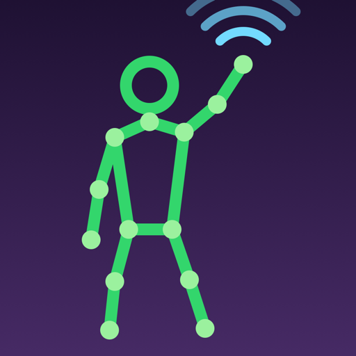&nbsp;&nbsp;
  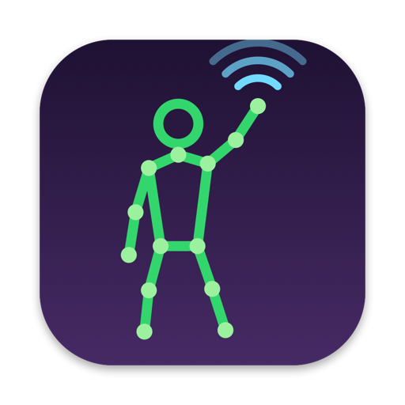&nbsp;&nbsp;
  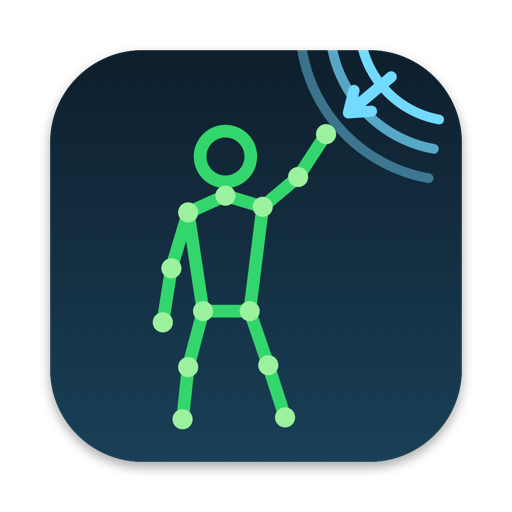
</p>
<p align="center"><em>TrackOSC for iOS&ensp;·&ensp;TrackOSC Sender for macOS&ensp;·&ensp;TrackOSC Receiver for macOS</em></p>
<p align="center">
  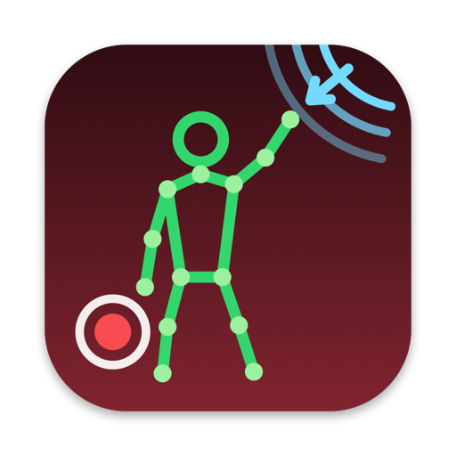&nbsp;&nbsp;
  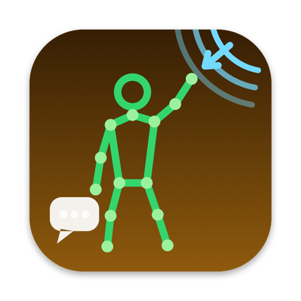&nbsp;&nbsp;
  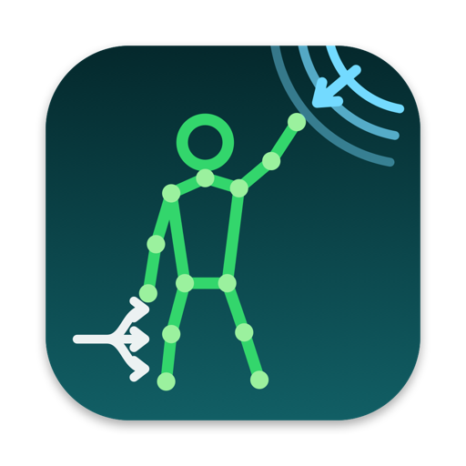&nbsp;&nbsp;
  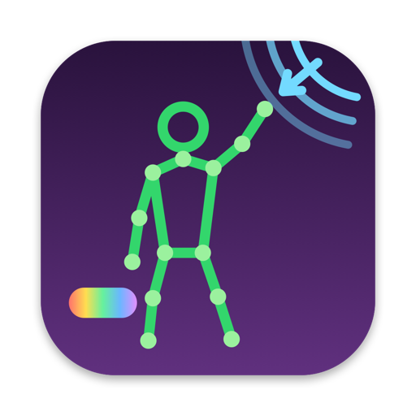&nbsp;&nbsp;
  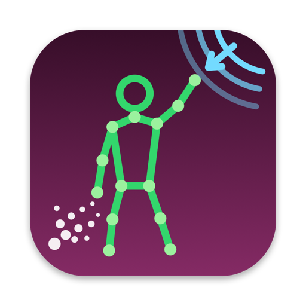&nbsp;&nbsp;
  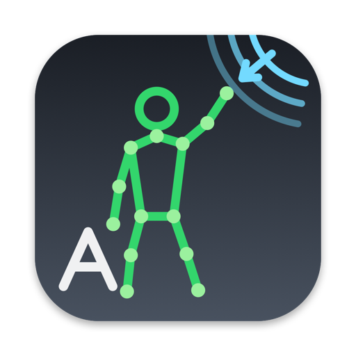
</p>
<p align="center"><em>TrackOSC Recorder&ensp;·&ensp;TrackOSC Speaker&ensp;·&ensp;TrackOSC Router&ensp;·&ensp;TrackOSC Colours&ensp;·&ensp;TrackOSC Particles&ensp;·&ensp;TrackOSC Text – six more macOS apps that do things with the stream</em></p>

Live camera → Apple Vision tracking → OSC. TrackOSC streams (almost) all of
[Apple's Vision framework](https://developer.apple.com/documentation/vision)
detection results – body poses in 2D and 3D, hand poses, face landmarks,
text, animals (boxes and skeletons), people, and barcodes – over the network
as [OSC (OpenSoundControl)](https://opensoundcontrol.stanford.edu) messages,
from an iPhone or a Mac, and visualises them in a companion receiver app.

TrackOSC (formerly Poseiosc) is a native-Swift successor to
[VisionOSC](https://github.com/LingDong-/VisionOSC) by LingDong-
(itself a successor to [PoseOSC](https://github.com/LingDong-/PoseOSC)) and
speaks **exactly the same OSC wire format**, so existing VisionOSC/PoseOSC
receivers (Processing, TouchDesigner, Max/MSP, openFrameworks…) work unchanged.

Nine apps plus open receiver examples for eight creative-coding environments:

- **TrackOSC** for iOS (iOS 18+, SwiftUI): live camera → Vision → OSC over UDP,
  with on-screen tracking overlays, per-detector toggles, front/back camera
  switch, portrait/landscape support with an orientation lock for mounted
  rigs, and Bonjour discovery of receivers.
- **TrackOSC Sender** (macOS 15+, SwiftUI): the same tracking pipeline running
  on a Mac camera – built-in, external webcam, or an iPhone via Continuity
  Camera – with a camera picker and a rig-rotation setting for cameras
  mounted sideways.
- **TrackOSC Receiver** (macOS 15+, SwiftUI): listens on UDP (default port
  9527), draws skeletons/landmarks/boxes with coordinate guides, switches to
  an orbitable 3D view for the 3D body poses, shows per-address message
  rates and a log, and advertises itself on the local network so senders
  can find it.
- **TrackOSC Recorder** (macOS 15+): records the stream to a
  [`.trackosc` file](Examples/RECORDING_FORMAT.md) – every datagram exactly
  as it arrived – and plays recordings back to any receiver at any speed,
  looping and scrubbing. Develop and demo everything else without a camera.
- **TrackOSC Speaker** (macOS 15+): reads the stream aloud with Apple's
  speech synthesis – "A person appeared. A hand appeared.", recognised text
  and codes, and a periodic summary of where everyone is – with every voice
  and every utterance option exposed.
- **TrackOSC Router** (macOS 15+): turns tracking events and values into
  **MIDI** notes and control changes, **Shortcuts**, **key presses** and
  **HTTP** requests, by rules you edit in the app – so a raised hand can
  start a song, a QR code can run an automation, and a nose can turn a knob.
- **TrackOSC Colours** (macOS 15+, Metal): gradients, colour fields and
  patterns driven by the stream – fourteen modes from glowing skeletons and
  Voronoi cells to heat maps and auroras, twelve palettes, nine presets,
  keyboard control, and a full-screen stage for walls and stages.
- **TrackOSC Particles** (macOS 15+, Metal): up to a hundred thousand
  physics particles driven by the stream – attraction, repulsion, orbits,
  sparks from fast joints, fire along the bones, ghosts of where people
  were, long exposures, flow fields, constellations, rain and snow that
  break on the body, a body made of dust, and fountains from the hands.
- **TrackOSC Text** (macOS 15+, Metal): kinetic typography from the text
  the sender reads, the codes it scans and your own words – letters that
  fall and get knocked about, words along skeletons and outlines, word
  clouds, orbits, scatter, a typewriter, a marquee, box labels and letter
  rain – in a choice of typefaces.
- **[Receiver examples](Examples/README.md)** for Processing, Python, p5.js,
  TouchDesigner, Max/MSP, Pure Data, openFrameworks and SuperCollider: each
  is a complete, hackable receiver of every TrackOSC message – the same
  drawing (or a sonification) as the native receiver – so you can start
  making software on the platform you already use, without touching the
  Apple stack.

> **A note on the receiver examples.** Only the **Processing**, **Python**
> and **p5.js** examples have been run end-to-end by the maintainer; the
> TouchDesigner parser is unit-tested but its network recipe hasn't been
> built in TouchDesigner, and the **Max/MSP**, **Pure Data**,
> **openFrameworks** and **SuperCollider** examples were written from those
> platforms' documentation and checked mechanically (valid patch files,
> consistent wiring) but never opened in the tool itself, because none of
> them is installed on the development machine. Treat those as careful
> first drafts: they follow the same parsing pattern as the verified ones,
> but expect to fix small things. If you try one, please
> [open an issue or pull request](https://github.com/JGL/TrackOSC/issues)
> saying which version you used and what changed – that is the most useful
> contribution this repository can get right now. The per-platform status
> is tabulated in [`Examples/README.md`](Examples/README.md).

The Mac apps are downloadable, notarised builds; the iOS app is
[free on the App Store](https://apps.apple.com/app/trackosc/id6795593815)
(or built from source with your own developer account); the Processing
sketch just needs the free [Processing](https://processing.org) editor.

<p align="center">
  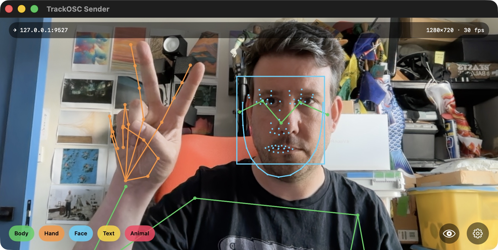
</p>
<p align="center"><em>The macOS sender tracking body, hand, and face at 30 fps, streaming OSC to <code>127.0.0.1:9527</code>.</em></p>

<p align="center">
  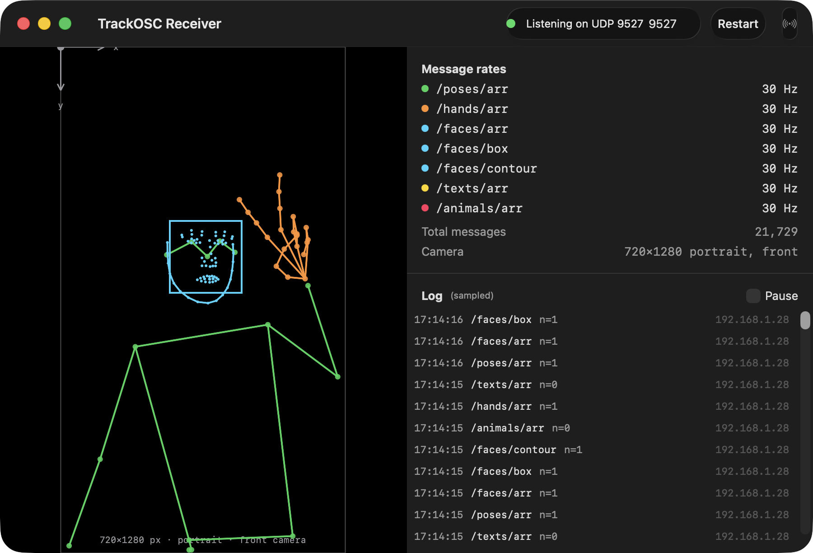
</p>
<p align="center"><em>The macOS receiver drawing the same scene from the OSC stream alone – with per-address
message rates, camera info, and a live log.</em></p>

<p align="center">
  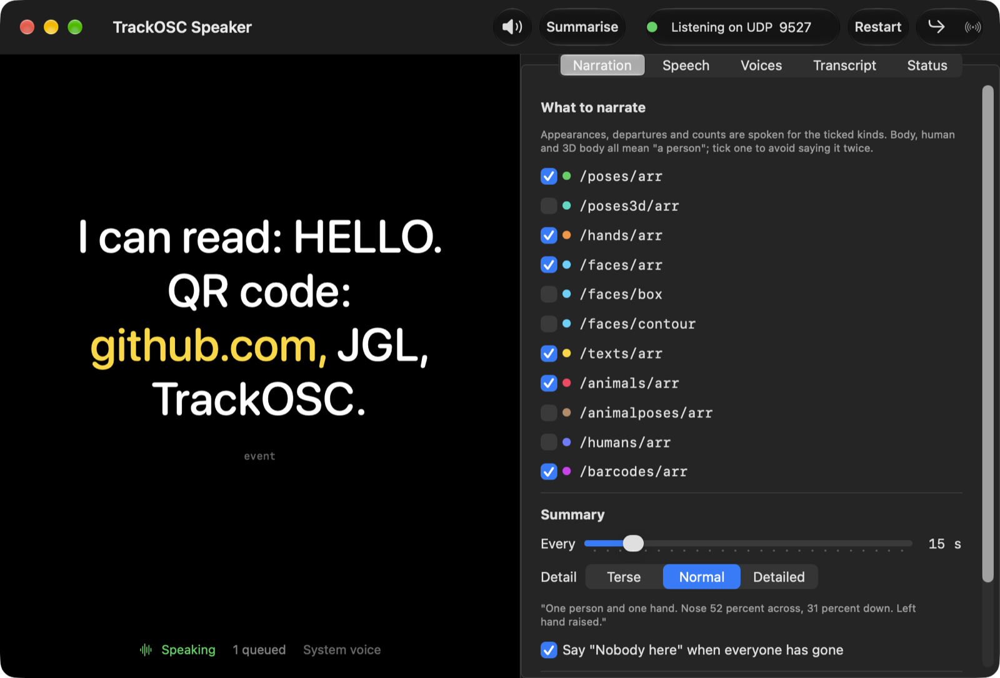
</p>
<p align="center"><em>TrackOSC Speaker reading the stream aloud: what is being said, large enough to read across a room, with the spoken words highlighted.</em></p>

<p align="center">
  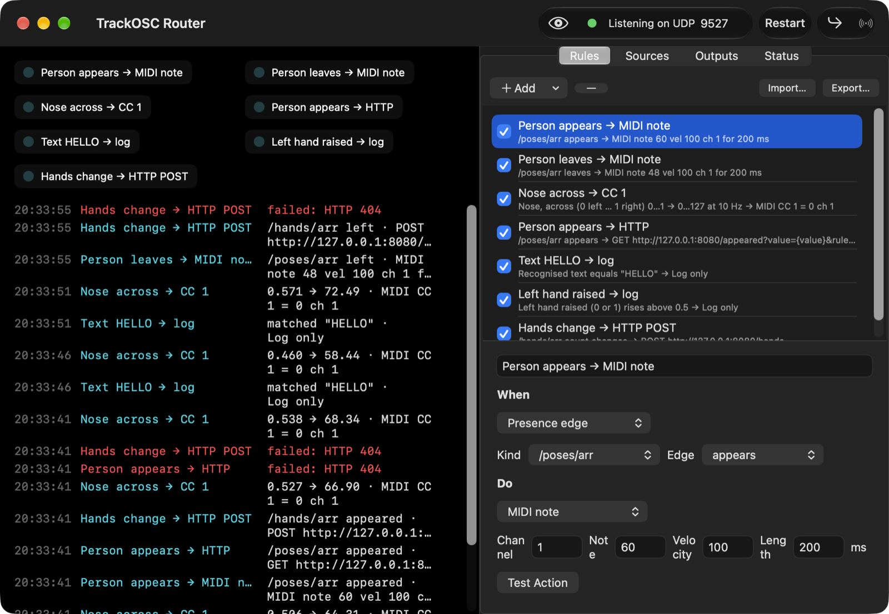
</p>
<p align="center"><em>TrackOSC Router turning appearances into MIDI notes, the nose position into a control change, recognised text into a log line and hand counts into HTTP requests.</em></p>

<p align="center">
  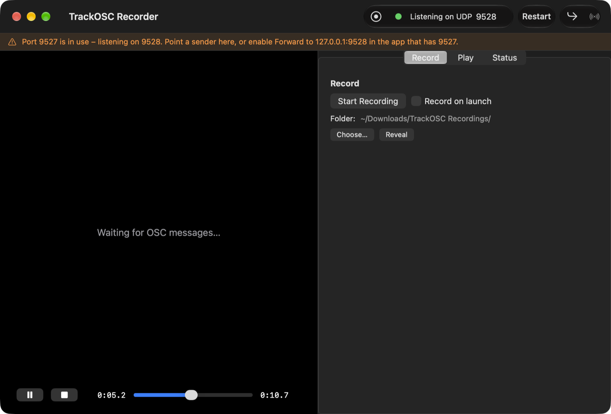
</p>
<p align="center"><em>TrackOSC Recorder playing a .trackosc file back to the receiver on port 9527 while itself listening on 9528.</em></p>

<p align="center">
  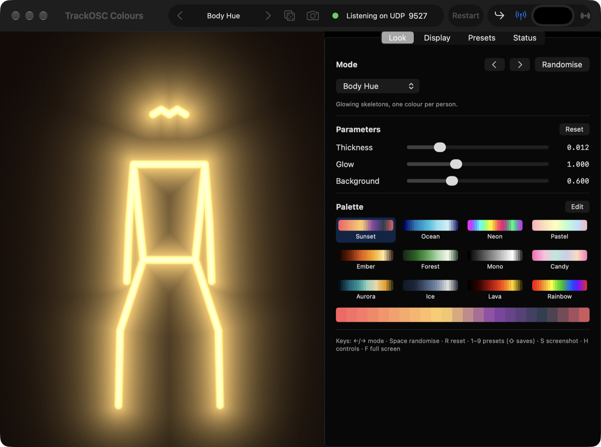
</p>
<p align="center"><em>TrackOSC Colours in its Body Hue mode, with the mode, parameters and palette controls beside the stage.</em></p>

<p align="center">
  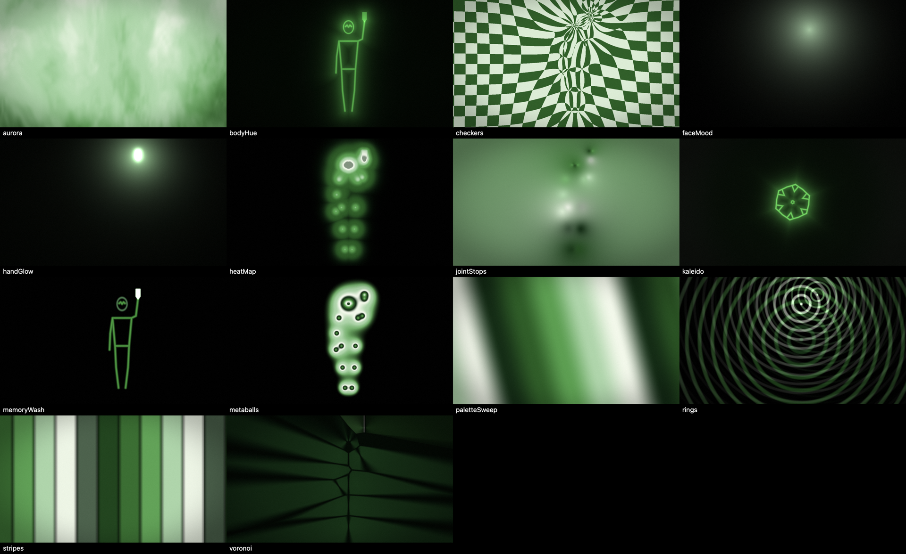
</p>
<p align="center"><em>All fourteen Colours modes from one synthetic figure (the app's own build check renders this).</em></p>

<p align="center">
  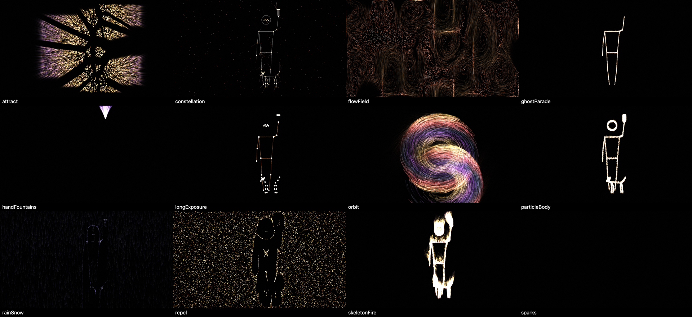
</p>
<p align="center"><em>The twelve Particles modes (Sparks is empty here because the synthetic figure never moves fast).</em></p>

<p align="center">
  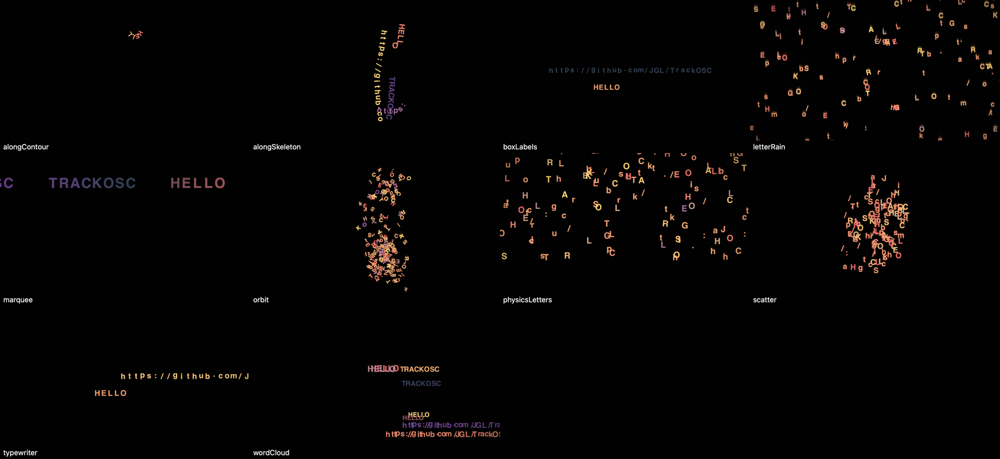
</p>
<p align="center"><em>The ten Text modes.</em></p>

<p align="center">
  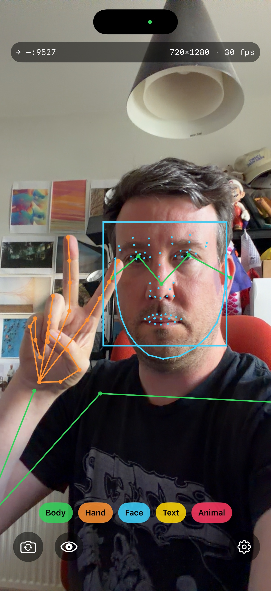
  &nbsp;&nbsp;
  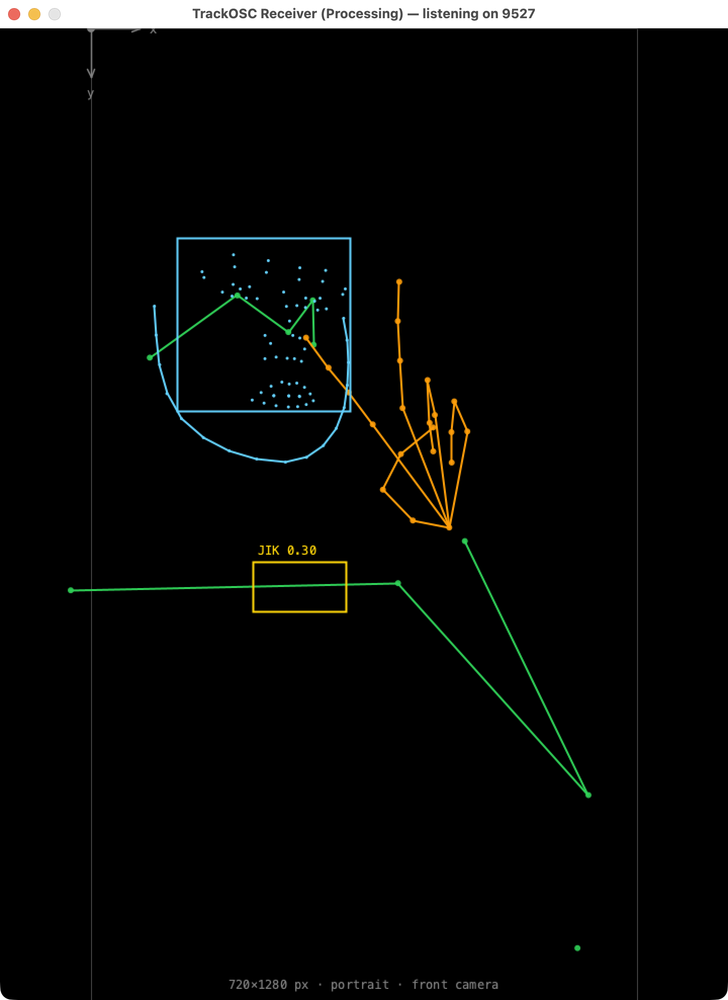
</p>
<p align="center"><em>Left: the iOS sender. Right: the open Processing (oscP5) receiver sketch drawing the
same wire format – no Apple stack required.</em></p>

## Quick start without building anything

All downloads are signed and notarised – no Gatekeeper hoops.

- **Mac receiver**: download `TrackOSCReceiver-<version>-macOS.zip` from the
  [Releases page](https://github.com/JGL/TrackOSC/releases), unzip, and open.
  Allow the **Local Network** prompt on first launch.
- **Mac sender**: download `TrackOSCSender-<version>-macOS.zip` from the same
  Releases page – the full tracking pipeline running on a Mac camera
  (built-in, external webcam, or your iPhone via Continuity Camera). Allow
  the **Camera** and **Local Network** prompts. Pick the camera, a rig
  rotation (for cameras mounted sideways), and the destination in its
  settings – receivers on the network appear automatically. To try
  everything on one Mac, run sender and receiver together and send to
  `127.0.0.1`.
- **Mac Recorder, Speaker, Router, Colours, Particles and Text**:
  `TrackOSC<Name>-<version>-macOS.zip` for each, from the same Releases page. Each listens on **9527** like the receiver, so
  a sender that already works with the receiver works with them unchanged;
  when 9527 is taken (say the receiver is running), the newcomer takes the
  next free port and tells you – see [Running several apps at once](#running-several-apps-at-once).
- **iPhone sender**: get [TrackOSC on the App Store](https://apps.apple.com/app/trackosc/id6795593815)
  (free, iOS 18+).
- **Receiver examples**: no Apple anything required – open the
  [Processing sketch](Examples/Processing/TrackOSCReceiver/TrackOSCReceiver.pde)
  in [Processing](https://processing.org) with the **oscP5** library, run
  the [Python](Examples/Python/) or [p5.js](Examples/p5js/) receiver, or
  pick TouchDesigner, Max/MSP, Pure Data, openFrameworks or SuperCollider
  from [`Examples/`](Examples/README.md). See
  [Receiver examples](#receiver-examples) for details.

Everything below is only needed if you want to build from source.

## Requirements (building from source)

- Xcode 16 or newer (with the iOS 18 and macOS 15 SDKs)
- A Mac running macOS 15 (Sequoia) or newer
- For the iOS sender: an iPhone running iOS 18 or newer
- An [Apple developer account](https://developer.apple.com) (the free tier works)
- Sender and receiver devices on the same Wi-Fi network (guest/hotel networks
  often block device-to-device traffic – see Troubleshooting)

All dependencies are Swift Packages resolved automatically by Xcode
([swift-osc](https://swiftpackageindex.com/orchetect/swift-osc) and the local
`PoseioscShared` package). Nothing else to install.

## Building the macOS receiver (and the Recorder, Speaker and Router)

1. Open `TrackOSC.xcodeproj` in Xcode.
2. Select the **TrackOSCReceiver** scheme, destination **My Mac** (the
   **TrackOSCRecorder**, **TrackOSCSpeaker** and **TrackOSCRouter** schemes
   build the other three the same way).
3. Signing: Xcode may ask you to pick a team – go to the target's
   **Signing & Capabilities** tab and select your team (personal is fine).
4. Run (⌘R).
5. First launch: macOS asks for **Local Network** permission – allow it, or
   the receiver can't be discovered (and on some setups can't receive at all).
   If the macOS firewall prompts about incoming connections, allow those too.

The toolbar shows the listening port (default **9527**) and the Bonjour name
it's advertising. You can change the port and press **Restart**.

## Building the macOS sender

Same as the receiver, with the **TrackOSCSenderMac** scheme. First launch
asks for **Camera** and **Local Network** permission – both are needed. In
its settings (gear icon): pick a camera (external webcams and iPhones via
Continuity Camera appear automatically), set **Rig rotation** if the camera
is mounted sideways, and choose a destination – discovered receivers are one
click. Send to `127.0.0.1` to feed a receiver on the same Mac.

## Building the iOS sender

1. In the same project, select the **TrackOSCSender** scheme and your iPhone
   as the destination (connect it by cable the first time).
2. In the **PoseioscSender** target's **Signing & Capabilities** tab, select
   your team. (Target and bundle-ID names keep the historical "Poseiosc" –
   bundle IDs are welded to App Store Connect and to users' granted
   permissions, so they deliberately never changed with the rename.) If
   you're building from source rather than installing from the App Store, also
   change the bundle identifier prefix `com.joelgethinlewis` to something of
   your own (e.g. `com.yourname.trackosc`) – either in Signing &
   Capabilities, or by editing `bundleIdPrefix` in `project.yml` and running
   `xcodegen generate`.
3. Run (⌘R). With a free developer account the app must be re-signed every
   7 days; paid accounts get a year.
4. On the iPhone, if the app won't launch: **Settings → General →
   VPN & Device Management** → trust your developer certificate.
5. First launch prompts: allow **Camera**, and allow **Local Network**
   (needed both for Bonjour discovery and for sending UDP to your Mac).
   If you decline Local Network by accident: Settings → Privacy & Security →
   Local Network → enable TrackOSC.

## Using it

1. Start the receiver on a Mac.
2. Start a sender (iPhone or Mac). In its settings (gear icon), the receiver
   should appear under **Discovered receivers** within a second or two – tap
   it. (Or type an IP and port manually – senders can also target
   TouchDesigner, Max/MSP, Processing, etc. on any port.)
3. Point the camera at a person: a skeleton appears on the sender's overlay
   and, live, on the receiver's canvas.
4. Toggle detectors with the chips along the bottom (2D Body / 3D Body /
   Hand / Face / Face Landmarks / Text / Animal / Animal Pose / Human /
   Barcode / Contours / Horizon / Rectangle – the row scrolls sideways on
   the iPhone). **Face** sends the box with head angles and the jawline;
   **Face Landmarks** sends the full 76-point constellation (eyes, pupils,
   brows, nose, lips, jaw) as `/faces/arr`, drawn feature by feature on
   both overlays. One Vision request serves both chips. More detectors = lower frame rate;
   2D Body + Hand + Face is the comfortable default. **3D Body** runs in its
   own lane at its own, lower rate so it never slows the other detectors;
   its rate is shown in Settings → Statistics. The status capsule shows
   destination, transmitted frame size, and processed fps.
5. Selfie-style previews are mirrored by default (like the Camera app) so
   they feel natural – but the OSC coordinates sent to receivers are
   **always unmirrored**, matching VisionOSC. Turn the mirror off in the
   sender's settings if you want the screen to match the receiver exactly.

### Camera orientation

Tracking quality is best when the declared orientation matches how the
camera is actually held, because Vision then analyses unrotated frames.

- **iPhone – Auto (default)**: follows the device as you rotate it between
  portrait and landscape; the transmitted frame dimensions swap accordingly
  (e.g. 720×1280 ↔ 1280×720).
- **iPhone – Portrait / Landscape Left / Landscape Right** (Settings →
  Camera): locks the assumed orientation. Use this when the phone is
  **mounted** – on a tripod, clamped sideways, or lying flat – because
  automatic detection fails when the phone is flat. If a locked landscape
  preview appears upside down, pick the other landscape option.
- **Mac – Rig rotation** (0°/90°/180°/270°): Mac cameras don't rotate on
  their own, so declare how the camera is physically mounted instead.

The current orientation and dimensions are always broadcast in the
`/camerainfo` OSC message and shown in the sender's status capsule and the
receiver's canvas.

### Testing without a camera

The shared package includes two CLI tools (run from `PoseioscShared/`):

```bash
swift run poseiosc-testsend 127.0.0.1 9527
```

sends synthetic animated frames of all fifteen message types – point it at
the receiver and you should see a walking stick figure, a waving hand, a
face ring with box and jawline, a "HELLO" text box, a "Cat" box, a 3D
figure two metres from the camera (switch the receiver to **3D**), a QR
code, a quadruped skeleton, a human box, two drifting outlines, a rocking
horizon and a rectangle in perspective. Add `--landscape` to send
landscape-oriented frames instead of portrait. Without Xcode,
`python3 Examples/Python/trackosc_testsend.py` sends the same scene.

```bash
swift run poseiosc-testlisten 9527
```

is a headless decoder that prints one line per received message (quit the
receiver app first – only one process can bind the port).

With a real scene recorded once by **TrackOSC Recorder** (or
`Examples/Python/trackosc_record.py`), play it back to anything instead:

```bash
python3 Examples/Python/trackosc_play.py session.trackosc --loop
```

### Receiver examples

[`Examples/`](Examples/README.md) holds a complete receiver for every
TrackOSC message in eight environments – FLOSS starting points for modding
and tinkering with no Apple toolchain required. Each parses the twelve
messages up to v1.4 (the native, Processing, Python and p5.js receivers
also draw the three v1.6 ones), draws (or sonifies) them, and shows the same coordinate guides as
the native receiver; joint orders and edge lists are shared via
[`Examples/SKELETONS.md`](Examples/SKELETONS.md).

- **[Processing](Examples/Processing/)** (oscP5): the 2D reference sketch,
  plus a P3D sketch drawing the 3D body poses in real 3D.
- **[Python](Examples/Python/)** (python-osc + pygame): a parser package, a
  window, a headless printer, and a synthetic sender.
- **[p5.js](Examples/p5js/)**: a Node bridge (browsers can't receive UDP)
  and a sketch; the client works in any web page.
- **[TouchDesigner](Examples/TouchDesigner/)**: OSC In DAT callbacks that
  fill Table DATs, a Script SOP, and a network recipe.
- **[Max/MSP](Examples/Max/)**: a `[js]` parser, a drawing patch, and a
  sonification.
- **[Pure Data](Examples/PureData/)** (vanilla): parse and joint-picking
  abstractions plus a sonification demo.
- **[openFrameworks](Examples/openFrameworks/)** (ofxOsc): a reusable C++
  parser with 2D and 3D views.
- **[SuperCollider](Examples/SuperCollider/)**: OSCdefs, sonification, and a
  drawing window.

The Processing, Python and p5.js examples were run by the maintainer; the
others were written from their platforms' documentation and are waiting for
someone with that tool installed to confirm them – pull requests welcome.

### Running several apps at once

Every macOS app in this repository that receives OSC – Receiver, Recorder,
Speaker, Router – listens on **UDP 9527** by default, the port both senders
target, so any one of them works out of the box. Only one process can own a
port, so when 9527 is already taken the app that launches next **falls
forward** to 9528, 9529… and shows a banner naming the port it got (and
advertises itself on that port, so it still appears in the senders'
Discovered receivers list). A port you type in explicitly is never changed
behind your back.

To feed one stream to several apps on one Mac, **chain** them: in the app
that has 9527, open the Forward popover (the ↳ toolbar button) and forward
to `127.0.0.1:9528`; that app can forward on to 9529, and so on. Forwarding
re-sends every datagram unchanged, so nothing is lost or re-encoded. A
sender can equally be pointed straight at any of the ports.

### Full screen

The receiver-type apps are built to run in installations and on stage.
**Full Screen → Enter Full Screen** (⌘⇧F) fills the screen with the stage
alone – the visualiser, the spoken sentence, the rule LEDs – on a flat
background with no title bar, toolbar, controls or cursor. Esc brings
everything back; ⌘⇧H hides or shows the controls without leaving full
screen; the menu also offers *Always on Top* when windowed and *Start in
Full Screen* so a Mac that boots into the app shows nothing else, and a
`--fullscreen` launch argument does the same for one launch:

```bash
open -a "TrackOSC Receiver" --args --fullscreen
```

The **background colour** is the colour well in the toolbar: black by
default, but any colour, and it fills the whole window in full screen.

### Several senders at once

When more than one sender targets the same port – an iPhone and the
Recorder playing a file back, say – the **Senders** toolbar popover decides
who is heard. *Latest sender wins* (the default) gives the stream to
whichever host most recently **started** sending, so pressing Play in the
Recorder takes over from the phone, and the phone gets the stream back a
second after playback stops. *All senders* mixes everything as it arrives
(the pre-1.6 behaviour) and *Only one host* pins a single address; the
popover lists the hosts heard in the last minute and the status panel
counts what was ignored. Ignored datagrams are invisible to forwarding
and recording too.

### TrackOSC Recorder

Records the incoming stream to a `.trackosc` file and plays one back to any
host and port. Recording is a tap on the raw datagrams, so the file holds
every message exactly as sent – including anything this version doesn't
decode – and playback reproduces the stream byte for byte at 0.25× to 4×,
looping, with a scrubber; after a seek the last `/camerainfo` is re-sent so
the receiver knows the frame size. Files go to `~/Downloads/TrackOSC
Recordings` or a folder you choose; **Record on launch** logs whole
sessions; a file double-clicked in the Finder opens and plays. The same
files are read and written by
[`trackosc_record.py` and `trackosc_play.py`](Examples/Python/) (standard
library only), and the format is documented in
[`Examples/RECORDING_FORMAT.md`](Examples/RECORDING_FORMAT.md). Record a
minute of a real scene once and every other app – and every receiver
example – can be developed on the train.

### TrackOSC Speaker

Narrates the stream with `AVSpeechSynthesizer`. Events are debounced so a
flickering detector doesn't produce a flickering commentary: a count has
to hold for 0.4 s to be believed and 0.8 s to be dropped. What gets said:
appearances, departures and count changes per message kind (tick the kinds
you want; body, human and 3D body all mean "a person", so tick one),
recognised text ("I can read: HELLO"), codes ("QR code: github.com, JGL,
TrackOSC" – URLs are read as words, not letters), animal names, and a
summary every *n* seconds at three levels of detail (counts; nose position
and raised hands; face direction, mouth open, distance and height from the
3D body). **Speech** exposes every utterance option – voice, rate within
the API's bounds, pitch 0.5–2×, volume, pauses before and after, the
assistive-technology preference, SSML – and how new sentences meet old
ones (latest wins, or a capped queue; interrupt immediately or at a word
boundary). **Voices** lists every voice installed on the Mac with
language, quality, gender and novelty/personal filters and a preview
button; more voices, including Enhanced and Premium ones, come from System
Settings → Accessibility → Spoken Content. **Transcript** shows what was
said and can append it to a text file.

### TrackOSC Router

Rules turn the stream into actions. A rule is a **trigger** – a message
kind appearing, leaving or changing count; a value rising above or falling
below a threshold (with hysteresis); a value entering or leaving a range; a
value mapped continuously from an input range to an output range at a
chosen rate; or text matching a pattern (equals, contains, regular
expression, with a cooldown) – over a **source** – counts, the nose or any
body or hand joint as a 0–1 fraction of the frame, raised hands, face
centre, width and angles, mouth openness, distance and height from the 3D
body, recognised text, code payloads, animal labels – and an **action**:

- **MIDI** note (with velocity and length) or control change, sent from a
  virtual MIDI source called *TrackOSC Router* that any DAW, synth or
  lighting desk can pick as an input, and optionally to a hardware
  destination too. A continuous rule drives the CC value or note velocity.
- **Shortcut**: runs a Shortcut by name, with `{value}`, `{text}` or
  `{rule}` as its input. macOS asks once for permission to control
  Shortcuts Events; if that is refused, the `shortcuts://` URL scheme is
  used instead.
- **Key press**: any key with modifiers, sent to the frontmost app – for
  remote clickers, games, video players. Needs Accessibility access
  (the Outputs tab requests it).
- **HTTP** GET or POST with templated URL and body – lights, OBS,
  Home Assistant, your own server.
- **Log only**, for checking a trigger before wiring it up.

The stage shows an LED per rule and the activity feed; **Dry run** logs
what would happen without sending; **Sources** shows every value live;
rules save as JSON in Application Support and can be imported, exported
and started from ten presets.

### TrackOSC Colours

Colour driven by people. Every frame the receiver's latest messages become
a *tracking scene* – people with stable identities and smoothed joints in
0–1 coordinates (mirrored, like a selfie, by default), their hands and
faces, recognised text, and two moods, presence and activity – and a Metal
shader paints the whole screen from it. Fourteen modes: **Body Hue**
(glowing skeletons, a colour per person), **Hand Glow**, **Joint Stops**
(every joint a colour stop of one smooth field), **Voronoi People**,
**Metaballs**, **Rings**, **Stripes** (turning with the shoulders),
**Checkers** (warped by whoever stands in it), **Memory Wash** and **Heat
Map** (which remember where people were), **Kaleido Body**, **Aurora**,
**Face Mood** (colour follows the gaze and the mouth) and **Palette
Sweep**. Each has three parameters; twelve palettes are built in and any
can be edited; nine preset slots save mode, parameters and palette
together. When nobody has been tracked for a while a synthetic figure
wanders through so the wall never goes dead (Display → Attract after).

Every mode uses whatever is arriving: cats and dogs from **Animal Pose**
are tracked and drawn exactly like people (their own colours); with Hand
and Face Landmarks on, hand skeletons and a face ring join the body in
the drawing modes, hand
joints and face centres become extra stops, seeds, warps and heat sources
in the field modes, and mouth openness and hand openness push the aurora,
stripes and metaballs about. A person's head is drawn from their face
landmarks when those arrive, otherwise as a circle.

**Recording**: the Record button (or the V key) writes the rendered
output – not a screen grab – to an H.264 `.mp4` in Downloads at the
window's resolution and 60 fps, ready to post; a portrait window gives a
portrait video. Keys on the stage: ←/→ mode, Space randomise, R reset,
1–9 load a preset (⇧1–9 saves), S screenshot, V record, H hide the
controls, F full screen. Frames are fitted (letterboxed) into the window by default; the
modes still fill the screen, only the people's positions are mapped into
the frame area. Adding a mode is one fragment function in
`Colours/Shaders/ColoursModes.metal` and one catalogue entry in
`Colours/ColoursModes.swift`; the app's `--snapshot-dir <folder>`
argument renders every mode to a PNG without a window, which is how the
contact sheet above was made:

```bash
open -a "TrackOSC Colours" --args --snapshot-dir ~/Downloads/colours-check
```

### TrackOSC Particles

The same tracking scene, drawn as particles simulated on the CPU and
rendered as additive sprites over a fading background (the *Trails*
parameter is how much of the last frame survives). Twelve modes: **Attract**
(every particle races for the nearest joint), **Repel** (a field parts
around the body), **Orbit** (moons around each person), **Sparks** (fast
joints throw sparks that fall), **Skeleton Fire** (bones burn), **Ghost
Parade** (where each person was, half a second ago and before), **Long
Exposure** (joints leave light that lingers), **Flow Field** (a current that
moving joints stir), **Constellation** (stars, and the lines that make a
figure of them), **Rain / Snow** (drops that break on the body), **Particle
Body** (the body made of dust) and **Hand Fountains**. Each mode has a
particle count (up to 100,000), size, speed, trails and one parameter of
its own; palettes, presets, keys, recording and the `--snapshot-dir` check
are the same as Colours. Cats, dogs, hands and faces take part everywhere.

### TrackOSC Text

Kinetic typography. The words come from three places: text the sender
reads (`/texts/arr`), codes it scans (`/barcodes/arr`), both kept for half a
minute after they were last seen, and your own words typed into the Words
box (one or more per line). Letters are sprites from a glyph atlas built
from the chosen typeface, so they move at the display rate and record like
everything else. Ten modes: **Physics Letters** (fall, pile up, get knocked
about by the body), **Along Skeleton** (words run along arms, spine and
legs), **Along Contour** (words trace `/contours/arr` outlines, or a jaw,
or the body's outline), **Word Cloud**, **Orbit** (letters circle every
joint), **Scatter** (a resting sentence that fast movements scatter),
**Typewriter** (recognised text typed out where it was read), **Marquee**
(words scroll past at the height of each head), **Box Labels** (text and
codes where they were seen) and **Letter Rain**.

### Hiding the video

Both senders have a **Hide video preview** option (the eye button on the
main screen, or the toggle in Settings): the camera and OSC output keep
running, but the screen shows only the tracking overlay on black – useful
on stage or in installations where the raw camera feed shouldn't be visible.

## Distributing the iOS sender via TestFlight

If you have a **paid** Apple Developer Program membership, you can put the
sender on TestFlight so testers (e.g. students) install it from a link –
no Xcode needed on their side.

One-time setup:

1. Sign in at [App Store Connect](https://appstoreconnect.apple.com) →
   **Apps → ＋ → New App**: platform iOS, a name (e.g. "TrackOSC"), your
   bundle ID (register it under **Certificates, IDs & Profiles** or let
   Xcode's signing pane register it first), any SKU string.
2. In Xcode, select the **TrackOSCSender** scheme with your team set.

Per release:

1. Bump `CURRENT_PROJECT_VERSION` in `project.yml` (every upload needs a
   higher build number) and run `xcodegen generate` – or edit the build
   number in Xcode's target General tab.
2. Select destination **Any iOS Device (arm64)** → **Product → Archive**.
3. In the Organizer window: **Distribute App → TestFlight & App Store →
   Upload** (accept the defaults).
4. In App Store Connect → your app → **TestFlight** tab: wait a few minutes
   for processing, then either
   - add **Internal Testers** (up to 100 App Store Connect users – instant), or
   - create an **External** group and enable a **public link** (up to 10,000
     testers – ideal for a class; the first build needs a one-off Beta App
     Review, usually a day or two).
5. Testers install the **TestFlight** app from the App Store and open your
   public link on the iPhone. Builds expire after 90 days – upload a new one
   before term ends!

The project already sets `ITSAppUsesNonExemptEncryption` to false (the app
contains no custom cryptography), so uploads skip the export-compliance
question.

## Releasing the macOS apps (maintainers)

`Scripts/release.sh` archives **every** macOS app (receiver, sender,
recorder, speaker, router), signs them with your Developer ID, submits them
all for notarisation in one batch, staples them, and publishes the zips as
one GitHub Release – so end users can download and double-click with no
Gatekeeper friction.

One-time setup:

1. A **Developer ID Application** certificate: Xcode → Settings → Accounts →
   your team → Manage Certificates → ＋.
2. Notary credentials in your keychain (use an
   [app-specific password](https://appleid.apple.com)):

```bash
xcrun notarytool store-credentials poseiosc-notary --apple-id you@example.com --team-id YOURTEAMID --password your-app-specific-password
```

3. The [GitHub CLI](https://cli.github.com) authenticated (`gh auth login`).

Then, per release – bump `MARKETING_VERSION` in `project.yml`, run
`xcodegen generate`, commit, and:

```bash
POSEIOSC_TEAM_ID=YOURTEAMID Scripts/release.sh
```

Add `--dry-run` to build/notarise without publishing, `--only A,B` to
release only some schemes, and `--skip-notarize` for a local signing test.
App icons are rendered from `Design/render_icons.swift` by
`Scripts/make_appiconsets.sh`.

## Coordinate system

Everything on the wire uses one convention – the same one VisionOSC uses:

```
(0,0) ──────────► x                width
  │  ┌───────────────────────────────┐
  │  │                               │
  ▼  │        pixels, y down         │ height
  y  │                               │
     └───────────────────────────(w,h)
```

- **Pixels**, not normalised: divide by the frame width/height from the
  message header (or `/camerainfo`) to normalise.
- **Origin top-left, y grows downward** (screen convention, not math
  convention).
- **Never mirrored.** The selfie-mirror option only flips the phone's
  *display*; wire coordinates are always the unmirrored scene.
- **Dimensions follow orientation**: portrait sends 720×1280, landscape
  1280×720. Listen to `/camerainfo` and your mapping code needs no
  special-casing:

```java
// Processing: map a TrackOSC point into your sketch window
float sx = x / frameW * width;   // frameW/frameH from the message header
float sy = y / frameH * height;
```

(For a full working example – parsing, skeletons, coordinate guides – see
[`Examples/Processing/TrackOSCReceiver`](Examples/Processing/TrackOSCReceiver/TrackOSCReceiver.pde).)

- A keypoint that wasn't detected arrives as `x=0, y=frameHeight,
  confidence=0` – always filter on `confidence == 0`.

## OSC wire format

Byte-compatible with VisionOSC. All messages are sent unbundled over UDP, one
per enabled detector per processed frame, **including when nothing is
detected** (header-only). Coordinates are as described above.

**`/camerainfo`** (TrackOSC addition; VisionOSC receivers ignore it) –
sent with every processed frame:

| # | Type | Value |
|---|------|-------|
| 0 | int32 | frame width in pixels |
| 1 | int32 | frame height in pixels |
| 2 | int32 | orientation: 0 = landscape, 90 = portrait, 180 = landscape flipped, 270 = portrait upside-down |
| 3 | int32 | camera facing: 0 = back, 1 = front |

Every message begins with the same header:

| # | Type | Value |
|---|------|-------|
| 0 | int32 | frame width (oriented pixels, e.g. 720) |
| 1 | int32 | frame height (e.g. 1280) |
| 2 | int32 | number of detections `n` (capped at 32) |

Then, per detection:

**`/poses/arr`** – `float` confidence, then 17 joints × (`float` x, `float` y,
`float` confidence). Joint order (PoseNet order): nose, leftEye, rightEye,
leftEar, rightEar, leftShoulder, rightShoulder, leftElbow, rightElbow,
leftWrist, rightWrist, leftHip, rightHip, leftKnee, rightKnee, leftAnkle,
rightAnkle.

**`/hands/arr`** – `float` confidence, then 21 joints × (x, y, confidence).
Order: wrist; thumb CMC, MP, IP, tip; index MCP, PIP, DIP, tip; middle …;
ring …; pinky … .

**`/faces/arr`** – `float` confidence, then 76 landmark points ×
(x, y, precisionEstimate), in Vision's constellation order.

**`/texts/arr`** – `float` confidence, `float` left, `float` top,
`float` width, `float` height, `string` recognised text.

**`/animals/arr`** – `float` confidence, `float` left, `float` top,
`float` width, `float` height, `string` label (`"Cat"` or `"Dog"`).

A joint/point that wasn't detected is sent as `x=0, y=frameHeight,
confidence=0` (VisionOSC's convention) – filter on `confidence == 0`.

### Face boundary messages (TrackOSC addition, v1.3)

VisionOSC's `/faces/arr` carries only the 76 landmark points – no face
boundary. TrackOSC adds two messages (VisionOSC receivers ignore them; the
five messages above are untouched). Both start with the standard
width/height/n header, and both list the **same faces in the same order**,
so index i in one matches index i in the other. (`/faces/arr` applies a
stricter landmark check and can, in rare cases, contain fewer faces – don't
assume its indices line up with these.)

**`/faces/box`** – per face, 8 floats (fixed stride: face *i* starts at
argument `3 + i×8`):

| Type | Value |
|------|-------|
| float | confidence |
| float × 4 | bounding box: left, top, width, height (pixels, origin top-left) |
| float × 3 | head rotation: roll, yaw, pitch in **degrees** (0 when unavailable) |

**`/faces/contour`** – per face: `float` confidence, `int32 m` (contour
point count), then m × (`float` x, `float` y). The contour is the jawline –
an **open** polyline from ear to chin to ear; don't close it. `m` varies by
OS version (typically 17) and is 0 when Vision reports no contour for that
face – always loop on `m`, never hardcode it.

### 3D body, barcode, animal-pose and human messages (TrackOSC addition, v1.4)

Four more additive messages, each behind its own detector chip. VisionOSC
receivers ignore them; the messages above are untouched. All start with the
standard width/height/n header, and every coordinate that is a pixel uses
the same convention as everything else (oriented frame, origin top-left,
never mirrored).

**`/poses3d/arr`** – per pose (fixed stride: pose *i* starts at argument
`3 + i×87`; joint *j* of pose *i* at `3 + i×87 + 2 + j×5`):

| Type | Value |
|------|-------|
| float | confidence |
| float | estimated body height in **metres** |
| 17 × (float x, float y, float z, float px, float py) | per joint: position in **metres** in Vision's camera-relative space, then the same joint projected into the frame in **pixels** |

Joint order (Vision's 3D skeleton, root first – *not* the PoseNet order of
`/poses/arr`): root, spine, centerShoulder, centerHead, topHead,
leftShoulder, leftElbow, leftWrist, rightShoulder, rightElbow, rightWrist,
leftHip, leftKnee, leftAnkle, rightHip, rightKnee, rightAnkle. All 17 joints
are always present – there is no missing-joint sentinel. The metric space is
right-handed with the camera at the origin, x to the right and y up; z runs
along the camera's axis (the receiver's 3D view and the Processing 3D
sketch each have a single sign constant should your device report it the
other way). The pixel projections let 2D-only receivers draw the 3D
skeleton without any projection maths. On iPhone the heights are measured
using the camera's intrinsics; on a Mac they are estimated from a reference
height. `/poses3d/arr` is sent at the 3D detector's own rate, typically
lower than the other messages.

**`/barcodes/arr`** – per code: `float` confidence, `float` left, top,
width, height (axis-aligned box), then 4 × (`float` x, `float` y) – the
corners of the code in **its own orientation**, top-left, top-right,
bottom-right, bottom-left (draw them as a closed quadrilateral) – then
`string` symbology (`QR`, `EAN13`, `Code128`, `DataMatrix`, `Aztec`,
`PDF417`, `MicroQR`, …) and `string` payload (empty when none).

**`/animalposes/arr`** – per animal: `float` confidence, then 25 joints ×
(`float` x, `float` y, `float` confidence), same conventions as
`/poses/arr` including the missing-joint sentinel. Joint order: nose,
leftEye, rightEye, leftEarTop, leftEarMiddle, leftEarBottom, rightEarTop,
rightEarMiddle, rightEarBottom, neck, leftFrontElbow, leftFrontKnee,
leftFrontPaw, rightFrontElbow, rightFrontKnee, rightFrontPaw,
leftBackElbow, leftBackKnee, leftBackPaw, rightBackElbow, rightBackKnee,
rightBackPaw, tailTop, tailMiddle, tailBottom.

**`/humans/arr`** – per person: `float` confidence, `float` left, top,
width, height. A whole-body box with no skeleton – cheap, and it counts
people at distances where pose estimation gives up.

Edge lists for drawing all four skeletons, and the colours the apps use,
are in [`Examples/SKELETONS.md`](Examples/SKELETONS.md).

### Contour, horizon and rectangle messages (TrackOSC addition, v1.6)

Three more additive messages behind three chips at the end of the row,
from Vision's `DetectContoursRequest`, `DetectHorizonRequest` and
`DetectRectanglesRequest`. Same header, same pixel conventions.

**`/contours/arr`** – per contour: `float` confidence, `int32` m, then m ×
(`float` x, `float` y): a **closed** outline (draw it with the last point
joined back to the first – unlike `/faces/contour`, which is open). Vision
returns every edge it finds, nested holes included, walked outline-first;
the sender simplifies each outline and caps a message at 64 contours and
4,000 points so it fits one datagram. Detection runs on a 512-pixel copy of
the frame, dark shapes on a light background.

**`/horizon`** – n is 0 or 1; when 1: `float` confidence, `float` angle in
degrees, then `float` x1, y1, x2, y2 – the horizon as a line through the
frame's centre from the left edge to the right edge. A positive angle
raises the right-hand end (one constant in the sender,
`horizonPositiveRaisesRight`, should a device say otherwise). Point the
camera at a real horizon or a tabletop edge to see it.

**`/rectangles/arr`** – per rectangle: `float` confidence, `float` left,
top, width, height, then 4 × (`float` x, `float` y) corners in the
rectangle's own orientation (top-left, top-right, bottom-right,
bottom-left), exactly like a barcode without the strings. Up to 16 per
frame, at least a tenth of the frame in size, confidence 0.5 or better –
screens, sheets of paper, picture frames, doors.

## Project layout

```
project.yml            XcodeGen spec (source of truth for the Xcode project)
TrackOSC.xcodeproj     Generated project (committed; users just open it)
PoseioscShared/        Swift package: wire format codec, models, skeleton
                       edge lists, coordinate mapping, CLI test tools, tests
SenderCore/            Platform-neutral sender pipeline shared by both
                       senders (Vision processing, OSC, Bonjour, overlay)
Sender/                iOS sender app shell (camera, rotation, UI)
SenderMac/             macOS sender app shell (camera picker, rig rotation)
ReceiverCore/          Shared by every receiver-type macOS app: UDP listener,
                       decoding, forwarding, port fall-forward, Bonjour, settings,
                       full screen, window shell, presence/metrics analysis,
                       tracking scene (person tracker, history, attract figure)
Receiver/              macOS receiver (2D + 3D visualisers, log)
Recorder/              macOS recorder/player (.trackosc files)
Speaker/               macOS speaker (narration engine, AVSpeech, voice catalogue)
Router/                macOS router (rules, MIDI/Shortcuts/keys/HTTP actions)
VisualCore/            Shared by the visual apps: Metal canvas and renderer (shader
                       modes plus a sprite/line layer and glyph atlas), recorder,
                       palettes, parameters, presets, inspector UI
Colours/               macOS colours app (fourteen shader modes)
Particles/             macOS particles app (CPU simulation, twelve behaviours)
Text/                  macOS kinetic text app (word pool, letter system, ten behaviours)
Examples/              Receiver examples: Processing, Python, p5.js, TouchDesigner,
                       Max/MSP, Pure Data, openFrameworks, SuperCollider – see
                       Examples/README.md; Examples/SKELETONS.md is the shared
                       joint-order/edge-list reference; Examples/RECORDING_FORMAT.md
                       specifies .trackosc files
Design/                App icon renderer
Scripts/               Notarised-release tooling
PROMPTS_AND_DECISIONS.md   Running record of prompts and design decisions
```

Contributing: source files added/removed? Run `brew install xcodegen` once,
then `xcodegen generate` and commit both `project.yml` and the regenerated
project. Wire-format changes must keep the golden-bytes test in
`PoseioscShared/Tests` green – that test *is* the VisionOSC compatibility
contract. Run tests with `cd PoseioscShared && swift test`. House style: en dashes (U+2013), never em dashes (U+2014), in code, comments and prose alike; `Scripts/release.sh` refuses to release while any tracked file contains one.

## Troubleshooting

- **Receiver never appears in a sender's list** – both devices on the same Wi-Fi?
  Many guest/campus/hotel networks enable *client isolation*, which blocks
  device-to-device traffic entirely; use a private network or a personal
  hotspot. Check Local Network permission on **both** devices, and that the
  Mac's firewall allowed TrackOSC Receiver. Verify the Mac is advertising:
  `dns-sd -B _osc._udp local.`
- **Discovered receiver won't resolve** – enter the Mac's IP manually
  (System Settings → Wi-Fi → Details → IP address).
- **Data sends but nothing draws** – confirm the port matches the receiver
  toolbar; check the receiver's total-message counter is climbing.
- **Overlay/receiver skeleton is rotated or flipped** – the sender assumes a
  portrait phone; keep the phone upright. (If it's still wrong on your device,
  please open an issue naming the iPhone model.)
- **Low frame rate** – disable Text/Animal (they're the slow ones), good
  lighting helps every detector.
- **Port 9527 already in use** – Protokol, OSC DataMonitor, or another
  receiver may be bound to it; only one process can listen per port.

## Related projects

Two other free tools turn cameras into OSC-speaking people sensors for
creative coding; each covers ground TrackOSC doesn't, and vice versa.

- **[openTSPS](https://github.com/labatrockwell/openTSPS)** – the "Toolkit
  for Sensing People in Spaces" from the LAB at Rockwell Group. A desktop
  openFrameworks/OpenCV app that runs blob and person tracking on webcams,
  **Kinect and other depth sensors**, or video files, and broadcasts the
  results as OSC, TUIO, TCP, or JSON over WebSockets. The classic choice
  for overhead or depth-camera installations that need presence, position
  and size of people rather than skeletons; it is in maintenance mode
  (built on openFrameworks 0.8), but still works and is well documented.
- **[tramontanaCV](https://tramontana.xyz)** – by Pierluigi Dalla Rosa,
  part of the Tramontana platform for prototyping interactive spaces with
  phones. An iOS app that uses the phone as a sensor, running **blob
  detection or face tracking** on its camera and sending the results over
  Wi-Fi to Processing (and, through Tramontana's libraries, to p5.js,
  JavaScript and openFrameworks). The closest precedent for TrackOSC's
  phone-as-tracker idea, with a lighter, blob-oriented output.

TrackOSC's niche next to them: Apple Vision's richer detectors – full body
skeletons in 2D and 3D, hand and face landmarks, animal skeletons, text
and barcodes – from any iPhone or Mac camera, speaking the VisionOSC wire
format so existing receivers keep working. If you need depth-camera
tracking of a whole room, reach for openTSPS; if you need the simplest
possible blob-from-a-phone, tramontanaCV; if you need skeletons and
landmarks, TrackOSC.

## Lineage & licence

Inspired by [VisionOSC](https://github.com/LingDong-/VisionOSC) and
[PoseOSC](https://github.com/LingDong-/PoseOSC) by LingDong-, which grew out
of [ofxFaceTracker](https://github.com/kylemcdonald/ofxFaceTracker) by Kyle
McDonald. OSC via [swift-osc](https://github.com/orchetect/swift-osc) by
Steffan Andrews.

MIT – see [LICENSE](LICENSE).

## Thanks

TrackOSC exists because [Golan Levin](https://flong.com) suggested building
it in the first place – a native, freely available successor to VisionOSC
that students could point at any receiver – and then test-drove every
release, sending the feedback that shaped the face boundary messages, the
Processing example, the screenshots, and the receiver examples for other
platforms. Thank you, Golan.
